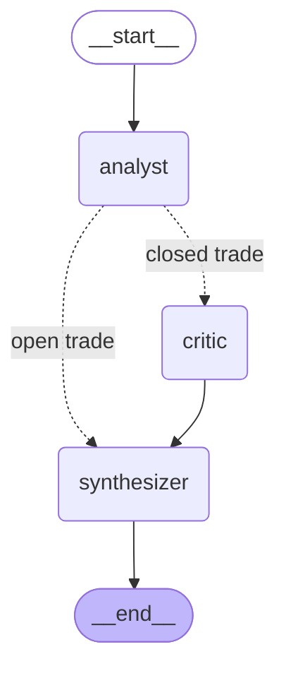

# LangChain + LangGraph trade explainer

LLM-powered post-hoc explainability layer for the pulse_bot trading
ML stack. Reads closed paper-trades from PostgreSQL, generates
structured human-readable narratives of *why* each ML decision
happened, and writes them to the dashboard for review.

**OFF the hot path.** LLM calls are 500-1500 ms per invocation
which is far too slow for live entry/exit decisions (T+30 budget
is <100 ms). This subsystem runs asynchronously after a trade
closes — purely for review and dashboard tooltips.

## Why this exists

The bot makes ~500 ML decisions per day across 8 models (entry
classifier, T+30 early-exit, regression PnL, timing, exit-quantile
SL/TP/max_hold, survival hazard). When a strategy goes wrong — like
the survival model collapsing into a uniform 95-second kill switch
that bled 11.5% WR for 3.5 hours — finding "why" by eyeballing logs
is slow. An LLM that ingests the trade row + features and answers
**"is this a healthy decision or a degenerate one?"** turns a
30-minute log spelunking session into a one-line dashboard tooltip.

## Architecture

Two layers, exercised by [`scripts/demo_trade_explainer.py`](../../scripts/demo_trade_explainer.py).

### Layer 1 — LangChain LCEL chain (one-shot)

```
prompt | llm | parser
```

* **Prompt** — `ChatPromptTemplate` with system message (analyst
  persona + grading heuristics specific to this bot) and a user
  message that templates in trade-row fields.
* **LLM** — `ChatAnthropic(claude-haiku-4-5, temperature=0)`. Picked
  for cost (~$0.001/trade) and reproducibility.
* **Parser** — `PydanticOutputParser` keyed off `TradeExplanation`,
  enforcing a deterministic shape (`entry_thesis`,
  `exit_assessment`, `quality_grade`, `follow_up`).

Source: [`pulse_bot/llm/explainer.py`](../../pulse_bot/llm/explainer.py)

### Layer 2 — LangGraph state machine (multi-step review)

When you want analyst/critic/synthesizer separation of concerns,
the LCEL chain is too monolithic. The graph below splits the work:



* **analyst** — first-pass interpretation in 2 sentences, no grade.
* **critic** — steel-mans the opposite read. Surfaces blind spots
  (e.g. "this -0.0070 SOL loss could also be entry-noise, not
  necessarily a kill-switch").
* **synthesizer** — reconciles analyst + critic into a final
  verdict + `quality_grade`.

The conditional edge after `analyst` skips the critic step entirely
for trades that haven't closed yet — there's nothing to second-guess.

Source: [`pulse_bot/llm/analysis_graph.py`](../../pulse_bot/llm/analysis_graph.py)

## Demo

### Interactive web UI (recommended for live demos)

```bash
.venv/bin/streamlit run pulse_bot/llm/streamlit_app.py
```

Opens at <http://localhost:8501>. Three tabs:

1. **LCEL chain** — pick a paper-trade from the sidebar, expand the
   rendered prompt to see exactly what gets sent to Claude, click
   **Run chain** to invoke and render the parsed `TradeExplanation`
   as a styled card with timing.
2. **LangGraph workflow** — runs the same trade through the
   3-node `StateGraph`; each node's output (analyst, critic,
   synthesizer) shows in its own expandable section with the final
   `quality_grade` badge.
3. **Architecture** — Mermaid diagrams of both layers, the typed
   state, and the test-isolation strategy.

The sidebar toggles **Stub** (FakeListChatModel — no API key, no
network) vs **Real** (Claude Haiku 4.5 — needs `ANTHROPIC_API_KEY`).

### CLI (batch)

Three modes:

```bash
# 1. Stub — uses FakeListChatModel, no API calls. End-to-end demo
#    of chain wiring, Pydantic parsing, file I/O. Default.
.venv/bin/python scripts/demo_trade_explainer.py --mode=stub --limit=5

# 2. Dry — renders the prompt template and prints what would be sent
#    to Claude. Validates wiring without touching an LLM at all.
.venv/bin/python scripts/demo_trade_explainer.py --mode=dry

# 3. Real — invokes Claude Haiku 4.5. Requires ANTHROPIC_API_KEY.
ANTHROPIC_API_KEY=sk-... \
  .venv/bin/python scripts/demo_trade_explainer.py --mode=real --also-graph --limit=3
```

Each run produces `trade_<id>_chain.md` per trade in this directory
(stub/real). Real mode with `--also-graph` adds `trade_<id>_graph.md`
showing the analyst → critic → synthesizer trace.

## Sample stub output

See [`trade_43834_chain.md`](trade_43834_chain.md) — a real
paper-trade where the survival model fired its signature -0.7%
fee-only kill at 97 seconds. The grader correctly tags this as
🔴 BAD with a `Disable survival or retrain` follow-up.

## Tests

```bash
.venv/bin/python -m pytest tests/pulse_bot/test_llm_explainer.py -v
```

5 tests cover:

1. LCEL chain round-trips through Pydantic into `TradeExplanation`
2. Pydantic schema preserves shape on `model_dump`
3. Conditional edge: open trade → skip critic
4. Conditional edge: closed trade → through critic
5. Graph compiles with all three nodes present

`FakeListChatModel` substitutes the LLM, so the suite runs in
~600 ms with zero network and zero API spend.

## What this demonstrates

| Concept                    | Where                                              |
|----------------------------|----------------------------------------------------|
| LCEL pipeline composition  | `explainer.build_trade_explainer_chain` (`prompt \| llm \| parser`) |
| `ChatPromptTemplate`       | `explainer._SYSTEM_PROMPT`, `_USER_PROMPT`         |
| Pydantic structured output | `TradeExplanation` + `PydanticOutputParser`        |
| Anthropic integration      | `ChatAnthropic(claude-haiku-4-5)`                  |
| LangGraph `StateGraph`     | `analysis_graph.build_analysis_graph`              |
| Typed state                | `AnalysisState(TypedDict)`                         |
| Conditional edges          | `_route_after_analyst` + `add_conditional_edges`   |
| Multi-agent orchestration  | analyst / critic / synthesizer reflection pattern  |
| Test isolation             | `FakeListChatModel` instead of live API in CI      |
| Domain integration         | Real PG paper_trade rows in `fixtures/trades_sample.json` |

## Trade-offs / honest limitations

* **Latency**: 500-1500 ms per chain.invoke makes this unusable in
  the live decision loop. It's only suitable for batch / dashboard
  explanations.
* **Cost**: real-mode runs cost ~$0.001 per trade × 500 trades/day =
  $0.50/day. Cheap individually, but *don't* call this on every
  fast-filter event — only on decisions that landed in
  `paper_trades` with `status='closed'`.
* **Prompt fragility**: changes to the bot's exit-reason taxonomy
  (e.g. introducing a new `dead_token_v2`) require updating the
  system prompt. Versioned prompts + A/B comparison via LangSmith
  is the natural next step but isn't wired up here.
* **Hallucination risk**: graded outputs are advisory only, not a
  source of truth. The bot's actual decisions live in `paper_trades`
  and the model registry — the LLM only narrates them.
